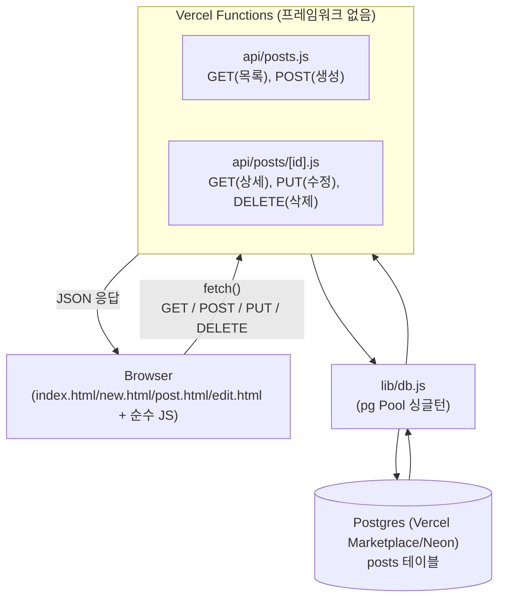
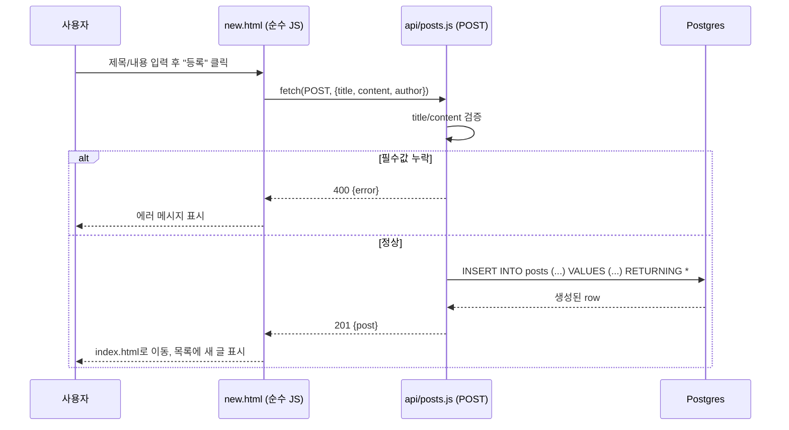
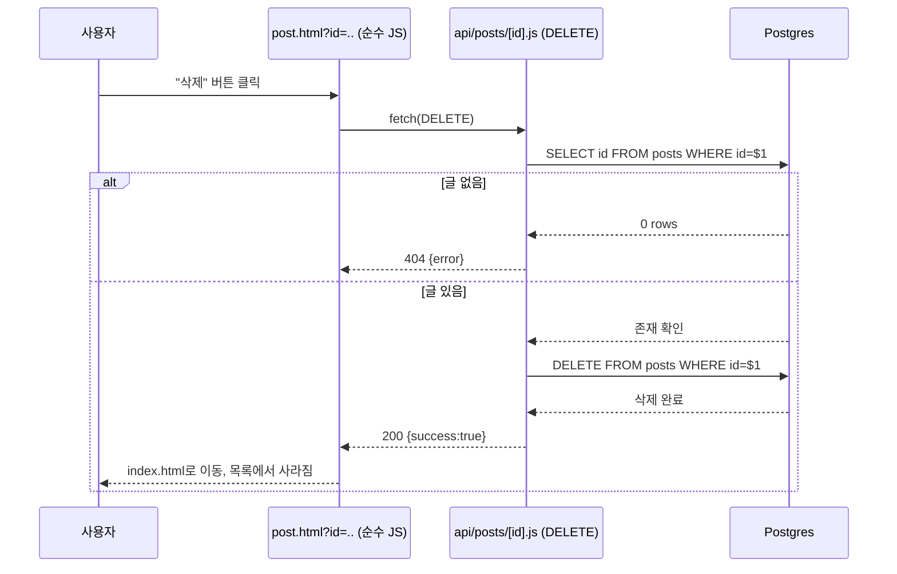
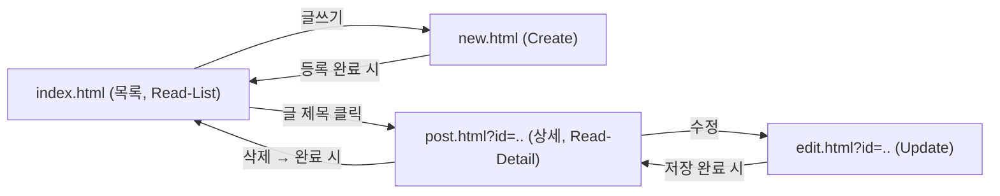

# 순수 CRUD 게시판 (학습용) — 설계 문서

## 배경 (Context)

이 프로젝트는 학생인 사용자가 CRUD 흐름과 게시판 개발에 필요한 기술을 배우기 위한 학습용 프로젝트다. 목표는 화려한 기능이 아니라 **Create / Read / Update / Delete 각 단계가 코드와 문서로 명확히 보이는 것**이다.

브레인스토밍을 통해 확정된 요구사항:

- 목적: 커뮤니티 게시판 형태를 학습용으로 구현 (실제 서비스 아님)
- 범위: 순수 CRUD만. 댓글, 검색, 페이지네이션, 권한 관리 없음
- 인증 없음: 로그인/회원가입 없음
- 권한 제한 없음: 누구나 모든 글을 수정/삭제 가능 (단순함 우선)
- 배포: Vercel 무료 티어 (비용 없어야 함)
- **프론트엔드: 순수 HTML/CSS/JavaScript (빌드 도구·프레임워크 없음)** — React, Next.js 등 프레임워크가 감추는 부분 없이 브라우저 기본기(DOM, fetch, 폼 이벤트)를 그대로 익히기 위함
- **백엔드: 프레임워크 없이 Vercel Functions(`/api` 디렉토리)** — 서버 개념(요청, 응답, HTTP 메서드 분기)을 처음 배우는 단계라 Express 등 프레임워크 없이 Node.js 스타일 `handler(request, response)` 함수를 직접 작성
- **DB: Vercel Marketplace(Neon 등)로 만든 Postgres + `pg` 패키지로 직접 SQL 작성 (ORM 없음)** — DB 개념도 처음 배우는 단계라 SQL을 직접 작성하며 학습
- 최종 산출물: 코드뿐 아니라, **CRUD 흐름을 이해할 수 있는 학습 문서**도 함께 필요

Context7로 최신 공식 문서를 확인해 아래 내용이 현재 기준으로 유효함을 검증했다:
- 프레임워크 없는 프로젝트에서 Vercel Functions는 `/api` 디렉토리에 파일을 두면 자동으로 함수로 배포되며, 클래식 Node.js 시그니처 `export default function handler(request, response) { response.status(200).json(...) }` 를 지원한다 (Vercel 공식 문서)
- `/api/posts/[id].js`처럼 대괄호 파일명을 쓰면 `/api/posts/:id` 동적 라우팅이 프레임워크 없이도 동작한다 (Vercel Functions 파일 기반 라우팅)
- Vercel의 Postgres 스토리지는 현재 Marketplace 연동(Neon, Supabase 등)으로 제공되며, 표준 `postgres://` 연결 문자열을 내려주므로 `pg` 같은 범용 드라이버로 그대로 연결할 수 있다

## 아키텍처 개요

정적 파일(HTML/CSS/JS)과 서버리스 함수(`/api`)를 같은 Vercel 프로젝트에 배포한다. 브라우저의 순수 JS가 `fetch`로 `/api/posts` 계열 엔드포인트를 호출하고, 각 함수는 `pg`로 Postgres에 직접 SQL을 실행한다. 프레임워크가 없으므로 "요청 → 서버 함수 → SQL → DB → 응답 → 화면 갱신" 흐름의 각 단계가 코드에 그대로 드러난다.



### CRUD 흐름 시퀀스 다이어그램

예시로 "글 작성(Create)"과 "글 삭제(Delete)" 흐름을 시퀀스 다이어그램으로 표현하면 다음과 같다. 나머지 Read/Update도 동일한 패턴(요청 → 서버 함수 → SQL → DB → 응답 → 화면 갱신)을 따른다.





### 페이지 이동도



## 데이터 모델

`posts` 테이블 (SQL DDL, ORM 없이 직접 작성):

```sql
CREATE TABLE IF NOT EXISTS posts (
  id SERIAL PRIMARY KEY,
  title TEXT NOT NULL,
  content TEXT NOT NULL,
  author TEXT,
  created_at TIMESTAMPTZ NOT NULL DEFAULT now(),
  updated_at TIMESTAMPTZ NOT NULL DEFAULT now()
);
```

(`author`는 인증이 없으므로 자유 입력 텍스트, 선택 항목)

## 파일 구조

빌드 도구가 없으므로 정적 파일은 프로젝트 루트에 그대로 두고, Vercel Functions만 `/api`에 둔다.

```
package.json                 # dependencies: pg 하나만
.env.example                 # DATABASE_URL 자리표시
index.html                   # Read - 목록
new.html                     # Create - 작성 폼
post.html                    # Read - 상세 (삭제 버튼 포함, ?id=로 글 식별)
edit.html                    # Update - 수정 폼 (?id=로 글 식별)
css/
  style.css
js/
  api.js                     # 공통 fetch 헬퍼
  list.js                    # index.html 전용 스크립트
  new.js                     # new.html 전용 스크립트
  post.js                    # post.html 전용 스크립트
  edit.js                    # edit.html 전용 스크립트
api/
  db.js                      # pg Pool 싱글턴 (모든 함수가 공유)
  posts.js                   # GET(목록), POST(생성)
  posts/
    [id].js                  # GET(상세), PUT(수정), DELETE(삭제)
```

## CRUD ↔ API 매핑

| CRUD | HTTP | 엔드포인트 | 설명 |
|------|------|-----------|------|
| Create | POST | `/api/posts` | 새 글 생성 |
| Read (목록) | GET | `/api/posts` | 전체 글 목록 조회 |
| Read (상세) | GET | `/api/posts/:id` | 글 하나 조회 |
| Update | PUT | `/api/posts/:id` | 글 수정 |
| Delete | DELETE | `/api/posts/:id` | 글 삭제 |

각 함수는 `request.method`를 직접 확인해 GET/POST(또는 GET/PUT/DELETE)를 분기 처리한다 (프레임워크의 자동 라우팅이 없으므로 이 분기 자체가 학습 포인트).

## 에러 처리 (최소 수준)

- 필수 필드(title, content) 누락 시 400 반환
- 존재하지 않는 id 조회/수정/삭제 시 404 반환
- 지원하지 않는 HTTP 메서드 요청 시 405 반환
- 그 외 예외는 try/catch로 감싸 500 반환
- 클라이언트는 실패 시 화면에 간단한 에러 메시지만 표시 (토스트 등 추가 UI 없음)

## 로컬 개발 & 배포 순서

1. `npm init -y` 후 `pg` 설치, `vercel` CLI 설치
2. `vercel login` → `vercel link`로 프로젝트 연결
3. Vercel 대시보드 → Storage → Marketplace에서 Postgres(Neon 등) 생성 및 프로젝트에 연결 → `DATABASE_URL` 계열 환경변수 자동 등록
4. `vercel env pull .env.local`로 로컬에 연결 문자열 가져오기
5. `psql`(또는 Vercel 대시보드의 SQL 편집기)로 위 `CREATE TABLE` DDL 실행해 `posts` 테이블 생성
6. `vercel dev`로 로컬에서 정적 파일 + `/api` 함수를 함께 실행하며 확인 (일반 정적 서버로는 `/api` 함수가 동작하지 않으므로 반드시 `vercel dev` 사용)
7. Git 저장소를 Vercel 프로젝트에 연결하여 배포 (무료 티어)

## 학습 문서화 (구현 이후 단계)

코드 구현이 끝난 뒤, `code-tutorial-builder` 스킬을 사용해 완성된 코드베이스를 기반으로 초보자용 단계별 마크다운 교재를 생성한다. 이 교재는 각 CRUD 동작(Create/Read/Update/Delete)이 프론트엔드 요청 → 서버 함수 → SQL → DB → 응답까지 어떻게 이어지는지 순서대로 설명하도록 구성한다.

## 검증 방법

- `vercel dev`로 로컬 실행 후 아래를 수동으로 확인:
  - 글 작성(Create) → 목록에 반영되는지
  - 목록(Read-List) → 상세 페이지 이동
  - 상세(Read-Detail) → 내용이 정확히 표시되는지
  - 수정(Update) → 변경 사항이 저장/반영되는지
  - 삭제(Delete) → 목록에서 사라지는지
- Vercel에 배포 후 동일한 5가지 흐름을 배포 환경에서 재확인 (Postgres 연결 확인)
- 자동화 테스트(Jest 등)는 이번 학습 범위에 포함하지 않음 (요청 범위 밖, 필요 시 추후 별도 요청)
