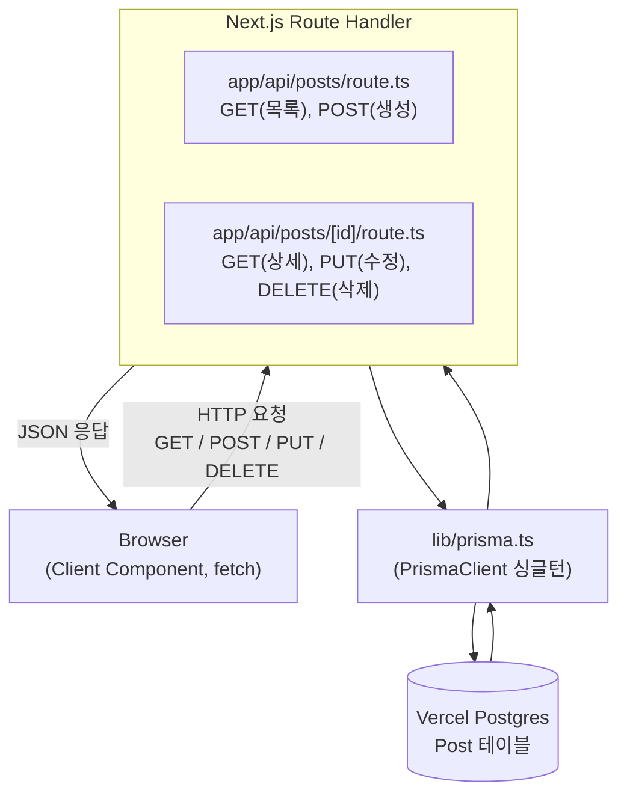
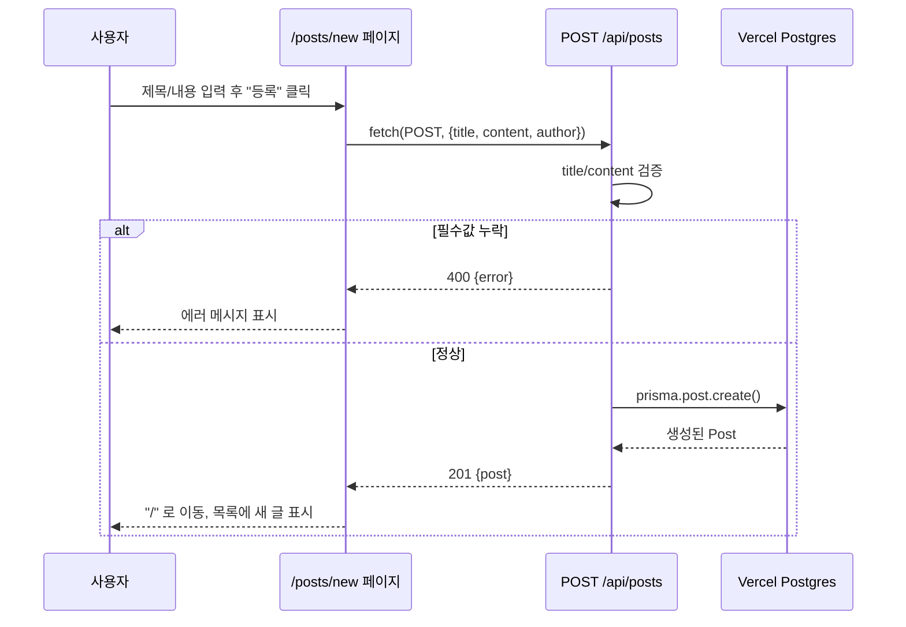
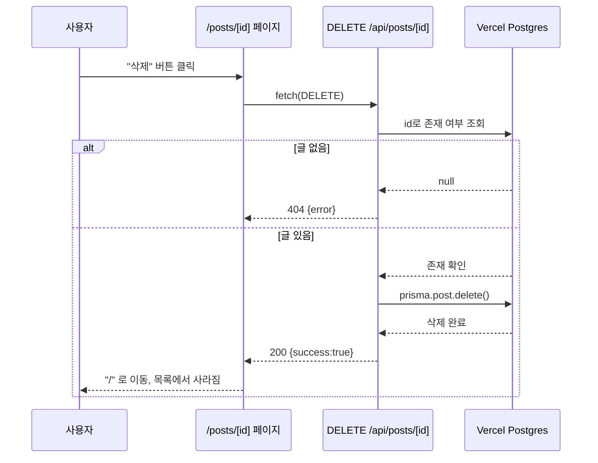
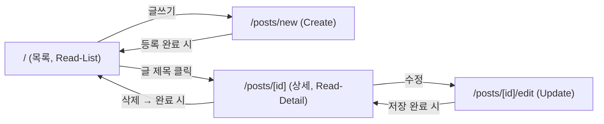

# 순수 CRUD 게시판 (학습용) — 설계 문서

## 배경 (Context)

이 프로젝트는 학생인 사용자가 CRUD 흐름과 게시판 개발에 필요한 기술을 배우기 위한 학습용 프로젝트다. 목표는 화려한 기능이 아니라 **Create / Read / Update / Delete 각 단계가 코드와 문서로 명확히 보이는 것**이다.

브레인스토밍을 통해 확정된 요구사항:

- 목적: 커뮤니티 게시판 형태를 학습용으로 구현 (실제 서비스 아님)
- 범위: 순수 CRUD만. 댓글, 검색, 페이지네이션, 권한 관리 없음
- 인증 없음: 로그인/회원가입 없음
- 권한 제한 없음: 누구나 모든 글을 수정/삭제 가능 (단순함 우선)
- 배포: Vercel 무료 티어 (비용 없어야 함)
- 프레임워크: **Next.js (App Router)** — 프론트/백엔드를 한 프로젝트에서 처리하고, Vercel과 동일 회사 제품이라 배포 마찰이 가장 적음
- DB 접근: **Prisma ORM + Vercel Postgres (Neon 기반, 무료 티어)** — create/read/update/delete 메서드로 CRUD를 직관적으로 대응시켜 학습에 적합
- 최종 산출물: 코드뿐 아니라, **CRUD 흐름을 이해할 수 있는 학습 문서**도 함께 필요

Context7로 최신 공식 문서를 확인해 아래 내용이 현재 기준으로 유효함을 검증했다:
- Next.js Route Handler는 `app/api/.../route.ts`에서 `GET`, `POST`, `PUT`, `DELETE` 함수를 named export로 작성 (Next.js 공식 문서)
- Prisma + Vercel Postgres 배포 시 `prisma.config.ts`에서 `POSTGRES_URL_NON_POOLING` 사용, `package.json`의 `vercel-build` 스크립트에 `prisma generate && prisma migrate deploy && next build` 설정 (Prisma 공식 문서)

## 아키텍처 개요

단일 Next.js 프로젝트. REST 스타일 API Route Handler를 명시적으로 작성하여 "브라우저 → fetch → API → Prisma → Postgres → 응답 → 화면 갱신" 흐름이 그대로 드러나게 한다. (Server Component에서 Prisma를 직접 호출하지 않고, 클라이언트에서 fetch로 API를 호출하는 방식을 택함 — REST CRUD 흐름을 눈으로 보는 것이 학습 목적에 부합)



### CRUD 흐름 시퀀스 다이어그램

예시로 "글 작성(Create)"과 "글 삭제(Delete)" 흐름을 시퀀스 다이어그램으로 표현하면 다음과 같다. 나머지 Read/Update도 동일한 패턴(요청 → Route Handler → Prisma → DB → 응답 → 화면 갱신)을 따른다.





### 페이지 이동도



## 데이터 모델

`prisma/schema.prisma`:

```prisma
model Post {
  id        Int      @id @default(autoincrement())
  title     String
  content   String
  author    String?  // 인증이 없으므로 자유 입력 텍스트, 선택 항목
  createdAt DateTime @default(now())
  updatedAt DateTime @updatedAt
}
```

## 파일 구조

```
package.json
prisma.config.ts
prisma/schema.prisma
lib/prisma.ts              # PrismaClient 싱글턴 (Next.js 개발 모드 다중 연결 방지 표준 패턴)
app/
  layout.tsx
  page.tsx                 # Read - 목록
  posts/
    new/page.tsx           # Create - 작성 폼
    [id]/page.tsx          # Read - 상세 (삭제 버튼 포함)
    [id]/edit/page.tsx     # Update - 수정 폼
  api/
    posts/route.ts         # GET(목록), POST(생성)
    posts/[id]/route.ts    # GET(상세), PUT(수정), DELETE(삭제)
.env.example               # POSTGRES_URL, POSTGRES_URL_NON_POOLING 자리표시
```

## CRUD ↔ API 매핑

| CRUD | HTTP | 엔드포인트 | 설명 |
|------|------|-----------|------|
| Create | POST | `/api/posts` | 새 글 생성 |
| Read (목록) | GET | `/api/posts` | 전체 글 목록 조회 |
| Read (상세) | GET | `/api/posts/[id]` | 글 하나 조회 |
| Update | PUT | `/api/posts/[id]` | 글 수정 |
| Delete | DELETE | `/api/posts/[id]` | 글 삭제 |

## 에러 처리 (최소 수준)

- 필수 필드(title, content) 누락 시 400 반환
- 존재하지 않는 id 조회/수정/삭제 시 404 반환
- 그 외 예외는 try/catch로 감싸 500 반환
- 클라이언트는 실패 시 화면에 간단한 에러 메시지만 표시 (토스트 등 추가 UI 없음)

## 로컬 개발 & 배포 순서

1. `create-next-app`으로 TypeScript 프로젝트 생성, Prisma 설치
2. Vercel 대시보드에서 프로젝트에 Postgres(Storage) 추가 → `POSTGRES_URL`, `POSTGRES_URL_NON_POOLING` 등 환경변수 자동 생성
3. `vercel env pull`로 로컬 `.env`에 연결 문자열 가져오기
4. `npx prisma migrate dev`로 로컬 마이그레이션 생성 및 커밋
5. `package.json`에 `"vercel-build": "prisma generate && prisma migrate deploy && next build"` 추가 → 배포마다 자동 마이그레이션 적용
6. Git 저장소를 Vercel 프로젝트에 연결하여 배포 (무료 티어)

## 학습 문서화 (구현 이후 단계)

코드 구현이 끝난 뒤, `code-tutorial-builder` 스킬을 사용해 완성된 코드베이스를 기반으로 초보자용 단계별 마크다운 교재를 생성한다. 이 교재는 각 CRUD 동작(Create/Read/Update/Delete)이 프론트엔드 요청 → API Route Handler → Prisma → DB → 응답까지 어떻게 이어지는지 순서대로 설명하도록 구성한다.

## 검증 방법

- `npm run dev`로 로컬 실행 후 아래를 수동으로 확인:
  - 글 작성(Create) → 목록에 반영되는지
  - 목록(Read-List) → 상세 페이지 이동
  - 상세(Read-Detail) → 내용이 정확히 표시되는지
  - 수정(Update) → 변경 사항이 저장/반영되는지
  - 삭제(Delete) → 목록에서 사라지는지
- Vercel에 배포 후 동일한 5가지 흐름을 배포 환경에서 재확인 (Postgres 연결 및 `vercel-build`의 마이그레이션 자동 적용 확인)
- 자동화 테스트(Jest 등)는 이번 학습 범위에 포함하지 않음 (요청 범위 밖, 필요 시 추후 별도 요청)
